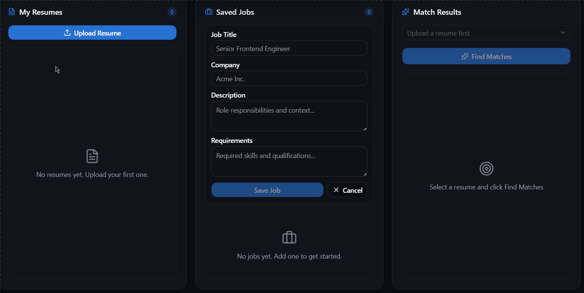

# AI Resume Screener & Job Matcher

A full-stack tool that matches your resume against job descriptions using real sentence embeddings instead of keyword matching. I built this as a portfolio project after applying to a bunch of roles and getting frustrated with how shallow most "resume matcher" tools are.

## Demo



## What it does

You paste in job descriptions you're applying to and upload your resume. The app computes a semantic similarity score between the two using a local embedding model, so it understands that "built REST APIs" and "developed backend services" mean roughly the same thing, which keyword matching completely misses.

## Tech stack

### Backend
| Tool | Purpose |
|------|---------|
| FastAPI | Async REST API framework |
| PostgreSQL + pgvector | Relational DB with native vector similarity search |
| SQLModel (async) | ORM layer over SQLAlchemy 2.0 |
| sentence-transformers | all-MiniLM-L6-v2 model, 384-dim embeddings |
| PyTorch (CPU) | ML inference engine |
| PyMuPDF | PDF text extraction |
| PyJWT + passlib/bcrypt | JWT auth + password hashing |

### Frontend
| Tool | Purpose |
|------|---------|
| React + TypeScript | UI framework |
| Vite | Dev server and build tool |
| Tailwind CSS v4 | Styling |
| shadcn/ui | Component library |
| axios | HTTP client |
| react-router-dom | Client-side routing |

### Infrastructure
Docker Compose runs three containers: frontend, backend, and Postgres with the pgvector extension pre-built.

## How the matching works

1. When you upload a resume or add a job, the text goes to `all-MiniLM-L6-v2`, which produces a 384-dimensional embedding: a numerical representation of what the text means, not just which words it contains.
2. Vectors are stored in Postgres via the `pgvector` extension.
3. When you request a match, the backend computes cosine similarity between your resume's vector and every saved job's vector in one batched call rather than looping.
4. Raw cosine similarity for real resume/job pairs usually falls between about 0.20 and 0.70, so that range gets rescaled to 0-100% to produce a score that actually reads as intuitive.

## Database schema

```
users ──< resumes ──< matches
users ──< jobs    ──< matches
```

| Table | Key fields |
|-------|-----------|
| users | id, email, hashed_password, full_name, is_active |
| resumes | id, user_id (FK), filename, file_path, raw_text, embedding (vector 384) |
| jobs | id, user_id (FK), title, company, description, requirements, embedding (vector 384) |
| matches | id, resume_id (FK), job_id (FK), score, explanation |

## API endpoints

**Auth**
- `POST /auth/register` - create account
- `POST /auth/login` - get JWT token

**Resumes** (bearer token required)
- `POST /resumes/upload` - upload PDF resume (multipart, max 5MB)
- `GET /resumes/` - list your resumes
- `GET /resumes/{id}` - get one resume
- `DELETE /resumes/{id}` - delete a resume

**Jobs** (bearer token required)
- `POST /jobs/` - add a job description
- `GET /jobs/` - list your saved jobs
- `GET /jobs/{id}` - get one job
- `DELETE /jobs/{id}` - delete a job

**Matching** (bearer token required)
- `POST /matches/compute?resume_id=XX` - score a resume against all your saved jobs

## Running locally

**Prerequisites:** Docker Desktop, Git

```bash
git clone https://github.com/rupinderkaur1904/resume-screener.git
cd resume-screener

cp backend/.env.example backend/.env
# edit backend/.env and set a real SECRET_KEY:
# python -c "import secrets; print(secrets.token_hex(32))"

docker compose up --build
```

Then open:
- Frontend: http://localhost:5173
- Backend API docs: http://localhost:8000/docs

First run takes a few minutes since Docker needs to pull the pgvector image and download the sentence-transformers model weights (~90MB). Both are cached in named volumes after that, so later starts are fast.

## Running tests

```bash
cd backend
pip install -r requirements-dev.txt
pytest
```

Tests cover the password hashing/JWT helpers, the match-scoring math, and the upload validation logic. They don't need Docker or a running database since those modules are kept as pure functions on purpose.

## Key design decisions

**Jobs are private, not a shared pool.** You add a job because you personally found it (copied from LinkedIn, etc.), not because you're browsing a public listing. This mirrors how tools like Jobscan actually work.

**Embeddings are generated in the background.** Upload returns immediately; the embedding is computed asynchronously afterward so users don't wait on ML inference during upload.

**Scores are rescaled, not raw.** Raw cosine similarity clusters in a narrow band for real resume/job pairs, so mapping that band to 0-100% produces something that actually feels meaningful.

## Project structure

```
resume-screener/
├── backend/
│   ├── app/
│   │   ├── api/           # routes and dependencies
│   │   ├── core/          # security helpers
│   │   ├── ml/            # model loader, inference functions
│   │   ├── models/        # SQLModel table definitions
│   │   ├── schemas/       # Pydantic request/response shapes
│   │   └── services/      # PDF parsing
│   ├── Dockerfile
│   └── requirements.txt
├── frontend/
│   ├── src/
│   │   ├── api/           # shared axios client
│   │   ├── components/    # reusable UI components
│   │   ├── pages/         # Auth, Dashboard
│   │   └── lib/           # utilities and type definitions
│   └── Dockerfile
└── docker-compose.yml
```

## Challenges and what I'd do differently

The rescaling constants for the match score (0.20-0.70 mapped to 0-100%) were tuned by eyeballing similarity scores on a handful of real resume/job pairs, not from a proper labeled dataset. It works reasonably well in practice but isn't rigorous, and a better version would calibrate this against actual hiring outcomes or at least a bigger sample.

The "explanation" for a match score right now is just the percentage restated in a sentence. The more useful version, actually surfacing which required skills are present versus missing, is still on my list; it needs a bit more thought on how to reliably extract skills from free-text resumes without just doing more keyword matching in disguise (which would undercut the whole point of the project).

I also didn't set up Alembic migrations before starting to iterate on the schema, so right now the app just does `create_all()` on startup. Fine for a personal project with no real data at stake, not something I'd ship to production as-is.

## Planned enhancements

- [ ] LLM-powered resume improvement suggestions
- [ ] Alembic migrations to replace `create_all()`
- [ ] Rate limiting and structured logging
- [ ] Real skill-gap explanations instead of a restated percentage
- [ ] Duplicate job detection using embedding similarity

## Author

**Rupinder Kaur**
BTech CSE, Thapar Institute of Engineering and Technology
[GitHub](https://github.com/rupinderkaur1904)
