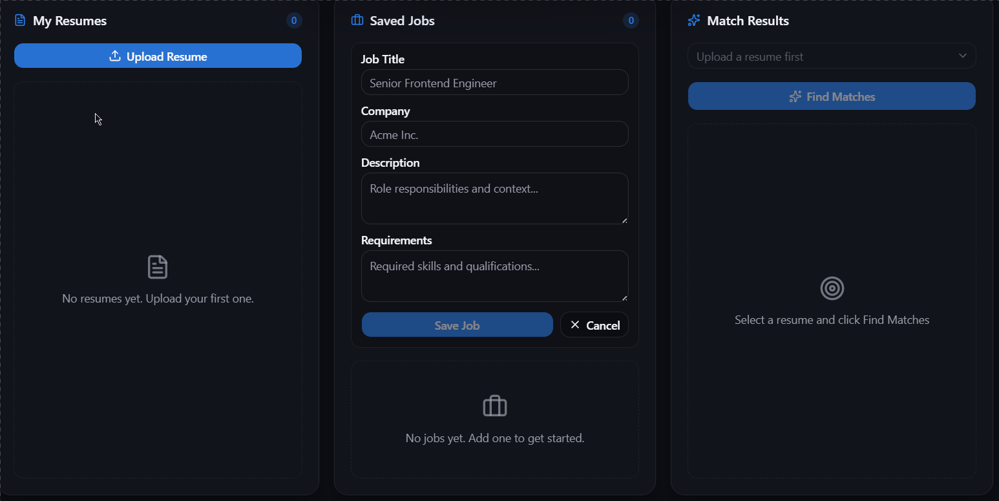

# AI Resume Screener & Job Matcher

A full-stack tool that matches your resume against job descriptions using real sentence embeddings instead of keyword matching. Built as a portfolio project after applying to a bunch of roles and getting frustrated with how shallow most "resume matcher" tools are.

## Demo




## What it does

You paste in job descriptions you're applying to and upload your resume. The app computes a semantic similarity score between the two using a local embedding model, so it understands that "built REST APIs" and "developed backend services" mean roughly the same thing — which keyword matching completely misses. Each match also comes with a keyword-overlap breakdown of which terms from the job posting show up in your resume and which don't, so the score isn't just a bare percentage.

## Tech stack

### Backend

| Tool                   | Purpose                                            |
| ----------------------- | --------------------------------------------------- |
| FastAPI                | Async REST API framework                           |
| PostgreSQL + pgvector  | Relational DB with native vector similarity search |
| SQLModel (async)       | ORM layer over SQLAlchemy 2.0                      |
| Alembic                | Schema migrations                                  |
| sentence-transformers  | all-MiniLM-L6-v2 model, 384-dim embeddings         |
| PyTorch (CPU)          | ML inference engine                                |
| PyMuPDF                | PDF text extraction                                |
| PyJWT + passlib/bcrypt | JWT auth + password hashing                        |
| slowapi                | Rate limiting on auth endpoints                    |

### Frontend

| Tool               | Purpose                   |
| -------------------- | --------------------------- |
| React + TypeScript | UI framework              |
| Vite               | Dev server and build tool |
| Tailwind CSS v4    | Styling                   |
| shadcn/ui          | Component library         |
| axios              | HTTP client                |
| react-router-dom   | Client-side routing        |

### Infrastructure

Docker Compose runs three containers locally: frontend, backend, and Postgres with the pgvector extension pre-built. In production, the frontend and backend are deployed separately (see **Deployment** below) rather than as containers on the same host.

## How the matching works

1. When you upload a resume or add a job, the text goes to `all-MiniLM-L6-v2`, which produces a 384-dimensional embedding — a numerical representation of what the text means, not just which words it contains.
2. Vectors are stored in Postgres via the `pgvector` extension.
3. When you request a match, the backend computes cosine similarity between your resume's vector and every saved job's vector in one batched call rather than looping.
4. Raw cosine similarity for real resume/job pairs usually falls between about 0.20 and 0.70, so that range gets rescaled to 0–100% to produce a score that actually reads as intuitive.
5. Alongside the score, a lightweight keyword-overlap pass compares resume text against the job posting and returns which terms matched and which are missing, so there's a concrete "why" behind the number.

## Database schema

```
users ──< resumes ──< matches
users ──< jobs    ──< matches
```

| Table   | Key fields                                                                            |
| ------- | -------------------------------------------------------------------------------------- |
| users   | id, email, hashed_password, full_name, is_active                                     |
| resumes | id, user_id (FK), filename, file_path, raw_text, embedding (vector 384), embedding_status |
| jobs    | id, user_id (FK), title, company, description, requirements, embedding (vector 384), embedding_status |
| matches | id, resume_id (FK), job_id (FK), score, explanation                                  |

Schema changes are managed with Alembic (`backend/alembic/versions/`), not `create_all()`.

## API endpoints

**Auth**
- `POST /auth/register` — create account
- `POST /auth/login` — get JWT token, rate-limited to 5/min
- `POST /auth/logout` — clear the session cookie
- `GET /auth/me` — current user profile

**Resumes** (auth required)
- `POST /resumes/upload` — upload PDF resume (multipart, max 5MB)
- `GET /resumes/` — list your resumes
- `GET /resumes/{id}` — get one resume
- `DELETE /resumes/{id}` — delete a resume

**Jobs** (auth required)
- `POST /jobs/` — add a job description
- `GET /jobs/` — list your saved jobs
- `GET /jobs/{id}` — get one job
- `DELETE /jobs/{id}` — delete a job

**Matching** (auth required)
- `POST /matches/compute?resume_id=XX` — score a resume against all your saved jobs

## Running locally

**Prerequisites:** Docker Desktop, Git

```bash
git clone https://github.com/rupinderkaur1904/resume-screener.git
cd resume-screener

cp backend/.env.example backend/.env
# edit backend/.env and set a real SECRET_KEY:
# python -c "import secrets; print(secrets.token_hex(32))"

docker compose up --build
```

Then open:
- Frontend: http://localhost:5173
- Backend API docs: http://localhost:8000/docs

First run takes a few minutes since Docker needs to pull the pgvector image and download the sentence-transformers model weights (~90MB). Both are cached in named volumes after that, so later starts are fast.

## Running tests

```bash
cd backend
pip install -r requirements-dev.txt
pytest tests/test_security.py tests/test_pdf_parser.py tests/test_new_features.py tests/test_inference.py -v
```

These cover the password hashing/JWT helpers, the match-scoring math, upload validation, ownership logic, and the rate limiter — and don't need Docker or a running database, since those modules are kept as pure functions on purpose.

`test_authorization.py` and `test_migration.py` need a live Postgres instance and are skipped otherwise; they run against a real `pgvector/pgvector:pg16` service in CI (see `.github/workflows/backend-tests.yml`).

## Deployment

The frontend and backend are hosted separately rather than as containers on one box:

- **Frontend** — Vercel, built from `frontend/` with Vite's standard build output.
- **Backend** — Render, deployed from `backend/Dockerfile` as a web service. The start command runs `alembic upgrade head` before starting uvicorn so the schema is always current on deploy.
- **Database** — Neon (Postgres with the `pgvector` extension enabled), used instead of Render's own Postgres so the database doesn't expire on a free tier.

A couple of things only matter because frontend and backend live on different domains in this setup, not when running locally with Docker Compose:
- The frontend's API client reads `VITE_API_BASE_URL` at build time to know where the backend lives, instead of relying on a same-origin relative path.
- The login cookie is set with `SameSite=None` (still `Secure` + `httpOnly`) so the browser will actually attach it to cross-origin requests from the Vercel domain to the Render domain.

## Key design decisions

**Jobs are private, not a shared pool.** You add a job because you personally found it (copied from LinkedIn, etc.), not because you're browsing a public listing. This mirrors how tools like Jobscan actually work.

**Ownership checks return 404, not 403.** Every resource lookup filters by the current user; a resource that exists but belongs to someone else returns 404 so a non-owner can't even confirm it exists.

**Embeddings are generated in the background.** Upload returns immediately; the embedding is computed asynchronously afterward via FastAPI's `BackgroundTasks`, offloaded from the event loop with `run_in_threadpool`, so users don't wait on ML inference during upload.

**Matching is batched, not looped.** Scoring a resume against N jobs is one vectorized cosine-similarity call across all N job embeddings at once, not N separate model calls.

**Scores are rescaled, not raw.** Raw cosine similarity clusters in a narrow band for real resume/job pairs, so mapping that band to 0–100% produces something that actually feels meaningful.

## Challenges and what I'd do differently

The rescaling constants for the match score (0.20–0.70 mapped to 0–100%) were tuned by eyeballing similarity scores on a handful of real resume/job pairs, not from a proper labeled dataset. It works reasonably well in practice but isn't rigorous, and a better version would calibrate this against actual hiring outcomes or at least a bigger sample.

The backend already computes matched/missing keywords per match, but the frontend only surfaces the summary sentence right now — the skill-chip breakdown isn't rendered in the UI yet. That's next on my list since it's the more useful half of the explanation feature.

Uploaded PDFs are stored on local disk, which works fine with Docker's named volumes locally but doesn't persist across restarts on free-tier hosting without object storage (e.g. S3) — acceptable for a demo, not something I'd leave as-is for real user data.

## Planned enhancements

- [ ] Render matched/missing skills in the UI, not just the summary sentence
- [ ] Visual indicator while an embedding is still processing, instead of a silent retry-needed error
- [ ] LLM-powered resume improvement suggestions
- [ ] Move uploaded files to object storage (S3-compatible) for durability across deploys
- [ ] Calibrate the score-rescaling constants against a larger, labeled sample
- [ ] Duplicate job detection using embedding similarity

## Project structure

```
resume-screener/
├── backend/
│   ├── app/
│   │   ├── api/           # routes and dependencies
│   │   ├── core/          # security helpers, rate limiter
│   │   ├── ml/             # model loader, inference functions
│   │   ├── models/        # SQLModel table definitions
│   │   ├── schemas/       # Pydantic request/response shapes
│   │   └── services/      # PDF parsing
│   ├── alembic/            # schema migrations
│   ├── tests/
│   ├── Dockerfile
│   └── requirements.txt
├── frontend/
│   ├── src/
│   │   ├── api/            # shared axios client
│   │   ├── components/    # reusable UI components
│   │   ├── pages/          # Auth, Dashboard
│   │   └── lib/            # utilities and type definitions
│   └── Dockerfile
├── .github/workflows/       # CI: backend tests, frontend build
└── docker-compose.yml
```

## Author

**Rupinder Kaur**
BTech CSE, Thapar Institute of Engineering and Technology
[GitHub](https://github.com/rupinderkaur1904)
